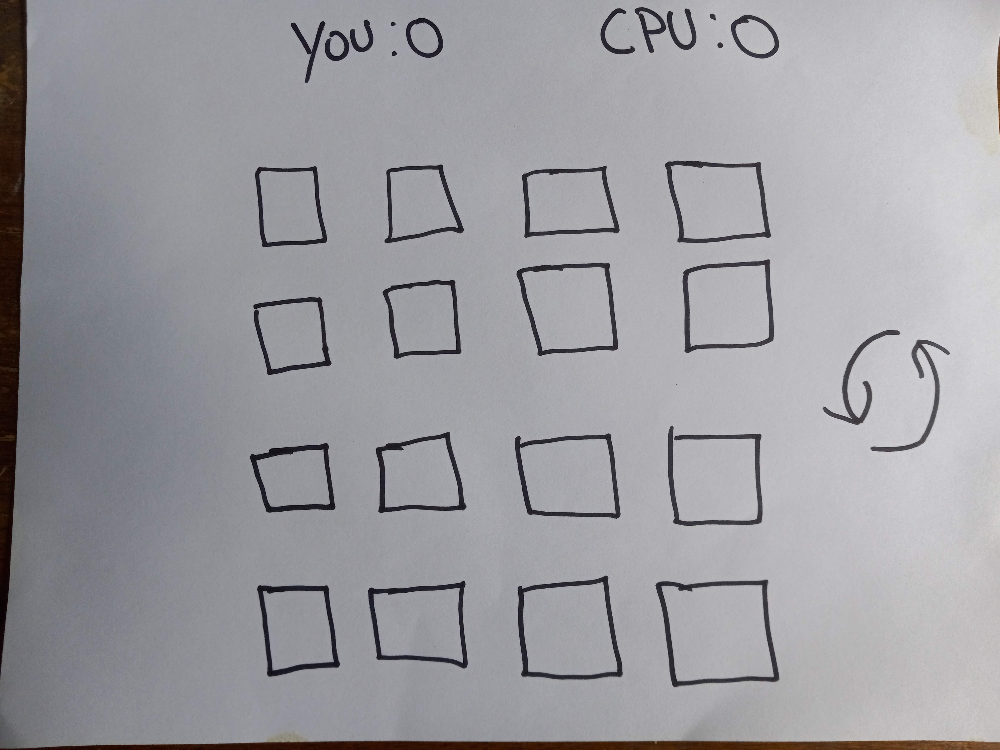

# P1-Matching-Game-GA-808
 Matching Game
 ___

A 4x4 matching card game. The game goal is to match all of the cards until there are none left. Games will be held between the player and a computer. Highest number of matches wins.

## Tech
___
- Js
- CSS
- HTML

## MVP
___
- 4x4 card grid
- Randomize cards after every game
- Show card face when card is clicked 
- Detection for all matches matched
- Display to track match points
- Display to show who won

## Stretch Goals
___
- Single player timed option
- Different themes
- Option to choose different board sizes/difficulties

- CSS effects for matches

## Potential road blocks

- Making the different difficulties
- Setting up the CPU

